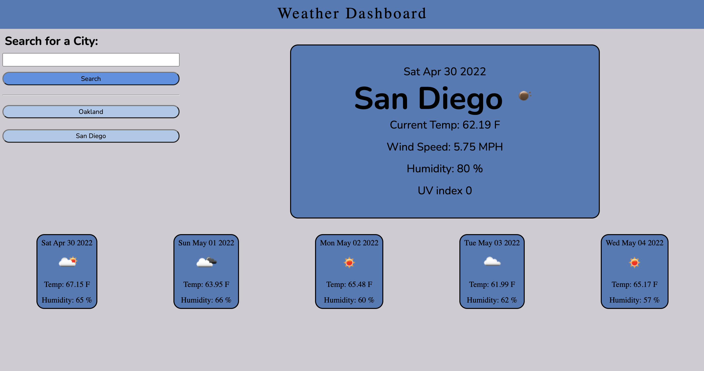

# weather-tracker
A weather tracker app

This weather tracker uses the Open Weather Current Weather API and the One Call API to get weather information based on name.
It gathers the data using the Fetch get method, then uses the data to set innerHTML on the page with the weather data.
The users searches are kept in localStorage which is used to generate buttons of previously searched cities upon future visits. The buttons work to use the city name as another fetch so clicking the buttons will get the weather information again after it was searched.

The fetch generates the current weather as well as a 5 day forecast.

There is a redundancy check to make sure buttons aren't added when a city is searched twice. There are also checks to make sure the form input is there, and that it is an actual city.

https://monacoglynn.github.io/weather-tracker/

